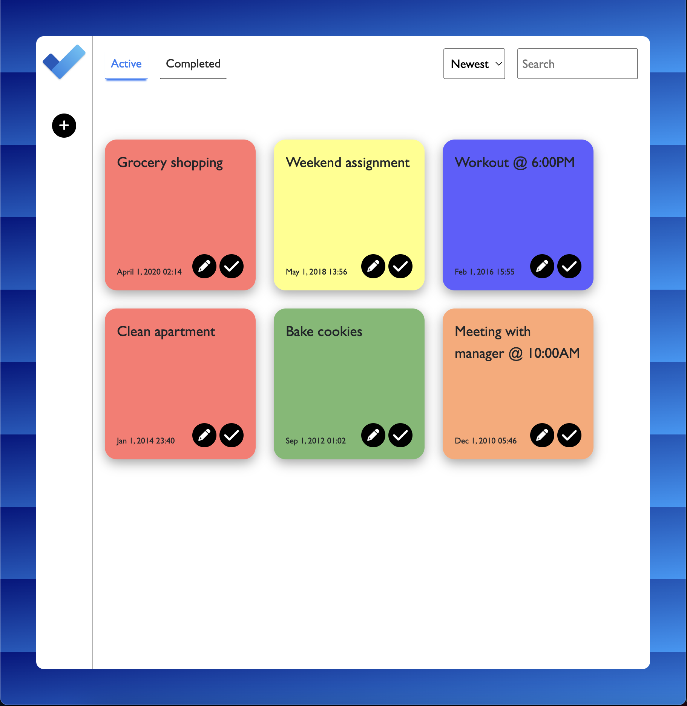

## Project Objective

Build an app to keep track of user tasks/to-do's using CRUD. Use Event - State - Render paradigm.
I wanted to focus heavily on UI/UX design for this project and give the user an intuitive experience.

## Features

The user can:

-   Add, edit and delete tasks
-   Create new categories, delete unwanted ones
-   Filter by search and newest/oldest
-   Complete and uncomplete tasks

## What I Learned

-   Solidified the Event - State - Render paradigm using jQuery
-   CSS Grid to organize cards in a responsive way
-   Design principles from studying and planning the project

## What I Would Add In The Future

-   The sort by newest/oldest returns a query that orders the rows by ASC or DESC based on id. The better way would be to parse the date-created/date-completed.
-   Filter by category dropdown
-   CSS animations to enhance the user experience
-   Incorporate Webpack into the project, I took a course on it recently and will be using it in the future

## How To Run The Project

-   Database name: `weekend-to-do-app`
-   Data in: `database.sql`

-   Run `npm install`
-   Run `npm start`

[###Deploy Link 🚀](https://cryptic-reef-41000.herokuapp.com/)

